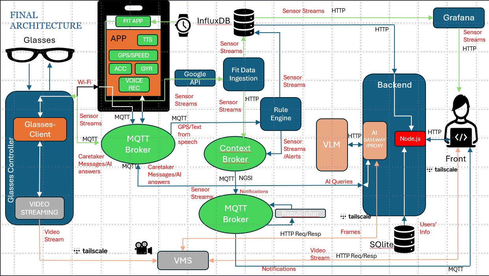

# Smart-glasses

## Quick Demo Of Caregiver Web Portal 

<p align="center">
  <video src="./images/app.mp4" width="750" autoplay loop muted playsinline></video>
</p>


## Overview

Smart-glasses is an IoT monitoring and assistive system for connected wearable glasses. The platform provides:

- Real-time telemetry (heart rate, location, device status)
- Vision-language assistance via a VLM API (image question → short answer)
- FIWARE Orion for entity management and subscription-based events
- InfluxDB for time-series metrics and analytics
- A web dashboard for monitoring, snapshots, and alerts

## Architecture



The project is organized into several components. See the folders for implementation details and Dockerfiles:

- `AI_Gateway/` — VLM proxy service: listens for AI queries, fetches camera snapshots, calls the VLM API, and publishes responses.
- `edge/` — Device-side code for smart-glasses (camera streamer, MQTT client, helpers).
- `fakers/` — Synthetic data publishers (heart-rate faker etc.) for testing.
- `glass_sdk/` — Cloud messenger + SDK for talking to glasses via MQTT.
- `ingestion-point/` — InfluxDB + FIWARE Orion ingestion, republishing, and fitness ingestion.
- `vms/` — Video ingestion & snapshot server (accepts raw frames and serves snapshots/streams).
- `web-app/` — Express/Handlebars web dashboard. It serves as the dashboard for the caregiver to monitor the wearer's state(live camera feed,live gps, health metrics and system's health) and communication.
- `user-app/` — MIT App Inventor project files (`.aia` and compiled `.apk`). It serves as the mobile companion app, responsible for real-time mobile telemetry streaming (GPS, accelerometer, gyroscope data) to the cloud for fall-detection processing, as well as providing the UI for custom VLM voice/text queries and communication with the caregiver who uses the web app.

## Key Services

Top-level services (defined in `docker-compose.yml`):

- `ai-gateway`
- `heart-rate-faker`
- `glass-messenger`
- `vms`
- `cb-initializer`
- `ingestion-backend`
- `fitness-ingestion`
- `mqtt-republisher`

Cloud components (important files):

- `AI_Gateway/vlm_proxy.py` — VLM gateway and MQTT bridge.
- `glass_sdk/glass_messenger.py` — Subscribes to cloud topics and forwards commands to devices.
- `ingestion-point/ingestion_backend.py` — Writes telemetry to InfluxDB and updates Orion.
- `ingestion-point/Orion_subscriptions/cb-subscriptions.py` — Creates Orion subscriptions for live notifications.
- `vms/stream_server.py` — Receives camera frames (TCP) and serves snapshots/streams (HTTP).

Edge components (device-side):

- `edge/main.py` — Supervisor for edge processes.
- `edge/pi_client.py` — MQTT client and device control logic.
- `edge/my_pi_streamer.py` — Camera streamer to the VMS ingestion port.

## MQTT Topics 

All services use a shared MQTT broker. Topics follow the `team08_2025` namespace.

- Telemetry & uplink (device → cloud):
	- `team08_2025/glasses/{device_id}/heart_rate` — Heart-rate samples
		Example payload:
		```json
		{"heart_rate": 78, "timestamp": "2026-07-31T09:10:11Z"}
		```
	- `team08_2025/glasses/{device_id}/location` — GPS location
		Example payload:
		```json
		{"lat": 37.98, "lng": 23.72, "ts": 1650000000}
		```
	- `team08_2025/glasses/{device_id}/status` — Device metrics (battery, cpu, mem)
		Example payload:
		```json
		{"battery": 85, "cpu_percent": 12.3, "mem_percent": 40.2}
		```
	- `team08_2025/glasses/{device_id}/fall_detect_sensor` — Raw fall-detection events

- Downlink & control (cloud → device):
	- `team08_2025/glasses/{device_id}/downlink` — Commands sent to the device via SDK
	- `team08_2025/glasses/{device_id}/uplink` — Device responses and confirmations

- AI (vision-language) topics:
	- Queries (device → cloud): `team08_2025/glasses/{device_id}/AI/queries`
		Payload: plain text question or short JSON with `prompt` field.
	- Responses (cloud → device): `team08_2025/glasses/{device_id}/AI/responses`
		Payload (example): `{"message": "There is a staircase ahead, take care."}`

- Alerts / events (published by ingestion/Orion/republisher):
	- `team08_2025/glasses/uplink/alert_high_heart_rate`
	- `team08_2025/glasses/uplink/alert_lowOxygen`
	- `team08_2025/glasses/uplink/alert_fall`
	- `team08_2025/glasses/uplink/alert_battery`

These topics are used by `cb-subscriptions` to create Orion subscriptions that forward entity attribute changes to MQTT.

## User Mobile App (MIT App Inventor)

The system includes a dedicated Android companion application built using MIT App Inventor. It acts both as a sensor hub and a user interface:

- **Sensor Data Streaming**: Continuously polls the smartphone's internal Accelerometer, Gyroscope, and Location (GPS) sensors, publishing raw payloads to `team08_2025/glasses/{device_id}/location` and telemetry topics.
- **Fall Detection**: The streamed IMU data is utilized by the cloud backend for real-time fall detection, triggering automated alerts if an anomaly is found.
- **VLM Interface**: Allows the user to input text or voice queries, publishing them directly to the AI queries topic and receiving VLM responses via MQTT subscriptions.
- **Communication Interface**: Allows the user to input text or voice to communicate with the caregiver who uses the web-app, publishing them directly to the communication queries and receiving the responses via MQTT and local text to voice.

> **Configuration Note**: The MQTT Broker IP is hardcoded into the App Inventor blocks during design time based on `template.env`. If you deploy a new broker, you must update the Broker URL inside the `.aia` project file and rebuild the `.apk` using the MIT App Inventor web platform.
## Environment

Copy the template files and fill in values before running:

- Root: copy `cloud.template.env` → `.env` and set broker, VLM, InfluxDB, Orion, and Google Fit credentials.
- Web app: copy `web-app/web.template.env` → `web-app/.env` and set `INFLUXDB_*` values.
- Edge: copy `edge/rpi.template.env` → `edge/.env` for device deployment.

## Build & Run

Start the cloud stack (from repository root):

```powershell
docker-compose up --build
```

Start the web dashboard (optional, local dev):

```powershell
cd web-app
npm install
npm run dev
```
You can login using the below credentials so the smart glasses ID is matching with the one used at edge:
- Username: user@mail.com
- Password: userpass

Start the edge testing container (from `edge/`):

```powershell
cd edge
docker compose up --build iot-testing
```

Or run the edge on a Raspberry Pi using `iot-app` in the same compose file.


## Data Flow 

1. Devices publish telemetry to MQTT topics under `team08_2025/glasses/{device_id}`.
2. `ingestion-backend` writes metrics to InfluxDB and updates Orion entities.
3. Orion subscriptions (cb-initializer) forward selected attributes to MQTT topics.
4. `ai-gateway` fetches snapshots from VMS and answers device AI queries.
5. `glass-messenger` delivers responses/commands to devices via the SDK.
6. `web-app` reads InfluxDB for dashboards and historical charts.

## Dependencies

- Python services: `paho-mqtt`, `requests`, `influxdb-client`
- Web app: `express`, `express-handlebars`, `dotenv`, `axios`, `mqtt`, `@influxdata/influxdb-client`

## Notes & Security

- Keep real secrets out of git — use the provided `*.template.env` files as examples.
- Ensure the MQTT broker is reachable by both cloud and edge hosts.
- VLM gateway requires a valid image-model API and correct API key + model name.


